# Marketplace de Templates

Comparte y monetiza tus workflows optimizados con la comunidad 🏪

## 🌟 Visión General

El Marketplace de n8n Agent Platform es un ecosistema vibrante donde los creadores pueden:

- **Publicar** workflows optimizados como templates
- **Monetizar** su conocimiento con revenue sharing 70/30
- **Descubrir** soluciones probadas por la comunidad
- **Instalar** templates con un solo click

<div className="glass-card">
  <h3>💰 Revenue Sharing</h3>
  <p>Los creadores reciben el <strong>70% de los ingresos</strong> generados por sus templates. Los pagos se procesan mensualmente vía Stripe.</p>
</div>

## 🚀 Publicar un Template

### 1. Preparar tu Workflow

Antes de publicar, asegúrate de que tu workflow:

- ✅ Esté completamente probado
- ✅ Incluya documentación clara
- ✅ No contenga credenciales hardcodeadas
- ✅ Siga las mejores prácticas

### 2. Crear el Template

```typescript
const template = {
  name: "Customer Support Bot",
  description: "Bot inteligente para soporte 24/7",
  category: "customer-service",
  tags: ["telegram", "ai", "support"],
  pricing: {
    type: "one-time", // o "subscription"
    price: 49.99,
    currency: "USD"
  },
  requirements: {
    n8nVersion: ">=1.98",
    nodes: ["telegram", "openai", "webhook"],
    apiKeys: ["OPENAI_API_KEY", "TELEGRAM_BOT_TOKEN"]
  }
};
```

### 3. Proceso de Publicación

```bash
# Via API
curl -X POST https://api.n8n-agent-platform.com/marketplace/publish \
  -H "Authorization: Bearer YOUR_TOKEN" \
  -H "Content-Type: application/json" \
  -d @template.json

# Via Dashboard
# 1. Ir a Marketplace > Mis Templates
# 2. Click en "Publicar Nuevo Template"
# 3. Completar formulario
# 4. Subir workflow exportado
```

### 4. Certificación con IA

Todos los templates pasan por un proceso de certificación automático:

```mermaid
graph LR
    A[Template Enviado] --> B{Análisis de Seguridad}
    B -->|Pass| C{Calidad del Código}
    C -->|Pass| D{Pruebas Automatizadas}
    D -->|Pass| E[✅ Certificado]
    B -->|Fail| F[❌ Rechazado]
    C -->|Fail| F
    D -->|Fail| F
```



## 📦 Categorías Disponibles

<div className="row">
  <div className="col col--4">
    <div className="feature-card">
      <h4>🤖 AI & Automation</h4>
      <ul>
        <li>Chatbots inteligentes</li>
        <li>Procesamiento de datos</li>
        <li>Análisis predictivo</li>
      </ul>
    </div>
  </div>
  <div className="col col--4">
    <div className="feature-card">
      <h4>💼 Business</h4>
      <ul>
        <li>CRM automation</li>
        <li>Invoice processing</li>
        <li>Lead generation</li>
      </ul>
    </div>
  </div>
  <div className="col col--4">
    <div className="feature-card">
      <h4>🛠️ DevOps</h4>
      <ul>
        <li>CI/CD pipelines</li>
        <li>Monitoring alerts</li>
        <li>Backup automation</li>
      </ul>
    </div>
  </div>
</div>

## 💎 Modelos de Precio

### One-Time Purchase
```typescript
{
  type: "one-time",
  price: 29.99,
  currency: "USD",
  includes: [
    "Lifetime access",
    "All updates",
    "Basic support"
  ]
}
```

### Subscription
```typescript
{
  type: "subscription",
  price: 9.99,
  period: "monthly",
  currency: "USD",
  includes: [
    "Premium support",
    "Priority updates",
    "Custom modifications"
  ]
}
```

### Freemium
```typescript
{
  type: "freemium",
  free: {
    features: ["Basic functionality", "Community support"]
  },
  pro: {
    price: 19.99,
    features: ["Advanced features", "Priority support", "API access"]
  }
}
```

## 🔍 Búsqueda y Filtros

### API de Búsqueda
```http
GET /api/marketplace/search?q=telegram&category=ai&sort=popular
```

### Respuesta
```json
{
  "results": [
    {
      "id": "tpl_123",
      "name": "AI Telegram Assistant",
      "author": {
        "name": "John Doe",
        "verified": true,
        "rating": 4.8
      },
      "price": 49.99,
      "downloads": 1234,
      "rating": 4.7,
      "certified": true
    }
  ],
  "total": 42,
  "page": 1
}
```

## 🛡️ Seguridad y Cifrado

### Protección de Propiedad Intelectual

Todos los templates se cifran antes de almacenarse:

```typescript
// Proceso de cifrado
const encryptedWorkflow = await encryptTemplate({
  workflow: originalWorkflow,
  authorId: user.id,
  algorithm: 'AES-256-GCM'
});

// Solo usuarios autorizados pueden descifrar
const decryptedWorkflow = await decryptTemplate({
  encryptedData: template.workflow,
  purchaseLicense: userLicense,
  userId: currentUser.id
});
```

### Verificación de Licencias

```typescript
// Verificar licencia antes de instalar
const isValid = await verifyLicense({
  templateId: 'tpl_123',
  userId: 'usr_456',
  licenseKey: 'LIC-XXXX-XXXX-XXXX'
});

if (!isValid) {
  throw new Error('Invalid license');
}
```

## 📊 Analytics para Creadores

### Dashboard de Ingresos

<div className="glass-card">
  <h4>📈 Métricas en Tiempo Real</h4>
  <ul>
    <li>Ventas totales: <strong>$12,450</strong></li>
    <li>Downloads este mes: <strong>234</strong></li>
    <li>Rating promedio: <strong>4.8/5</strong></li>
    <li>Templates activos: <strong>7</strong></li>
  </ul>
</div>

### API de Analytics
```http
GET /api/marketplace/creator/analytics
Authorization: Bearer YOUR_TOKEN
```

```json
{
  "revenue": {
    "total": 12450,
    "thisMonth": 1850,
    "pending": 320
  },
  "templates": [
    {
      "id": "tpl_123",
      "name": "Customer Support Bot",
      "sales": 156,
      "revenue": 7644,
      "rating": 4.8,
      "reviews": 89
    }
  ],
  "topCountries": ["US", "UK", "DE", "FR", "ES"]
}
```

## 🌟 Mejores Prácticas

### Para Creadores

1. **Documentación Clara**
   ```markdown
   # Mi Template
   
   ## Requisitos
   - Node.js 18+
   - OpenAI API Key
   
   ## Instalación
   1. Importar template
   2. Configurar credenciales
   3. Activar workflow
   
   ## Configuración
   ...
   ```

2. **Versionado Semántico**
   ```json
   {
     "version": "1.2.3",
     "changelog": {
       "1.2.3": "Fix: Corregido error en webhook",
       "1.2.0": "Feature: Añadido soporte multiidioma",
       "1.0.0": "Release inicial"
     }
   }
   ```

3. **Testing Exhaustivo**
   - Prueba en diferentes escenarios
   - Incluye casos edge
   - Documenta limitaciones conocidas

### Para Compradores

1. **Verificar Certificación** ✅
2. **Leer Reviews** ⭐
3. **Revisar Requisitos** 📋
4. **Probar en Staging** 🧪

## 🎯 Roadmap del Marketplace

### Q1 2024
- [ ] Sistema de reviews mejorado
- [ ] Bundles de templates
- [ ] API pública para integraciones

### Q2 2024
- [ ] Programa de afiliados
- [ ] Templates colaborativos
- [ ] Marketplace SDK

### Q3 2024
- [ ] AI recommendations
- [ ] Template customization service
- [ ] Enterprise marketplace

<div className="agent-message">
💡 <strong>Pro Tip:</strong> Los templates más exitosos resuelven problemas específicos y bien documentados. ¡Enfócate en calidad sobre cantidad!
</div>