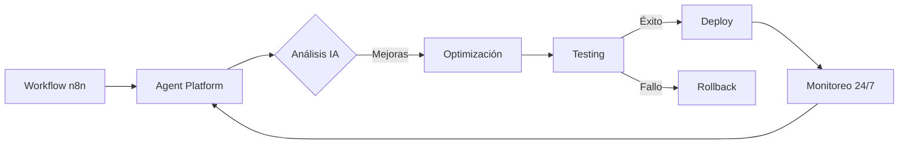

# Introducción

Bienvenido a la documentación de **n8n Agent Platform** 🚀

## ¿Qué es n8n Agent Platform?

n8n Agent Platform es una plataforma autónoma de agentes de IA diseñada para optimizar continuamente tus workflows de n8n. El sistema funciona 24/7, revisando, modificando y mejorando automáticamente tus workflows usando modelos de IA avanzados como GPT-4 y Claude.

¡Hola! Soy tu Workflow Wizard 🧙‍♂️ y estoy aquí para hacer tu vida más fácil optimizando tus workflows mientras duermes!

## 🎯 ¿Para quién es esta plataforma?

- **Desarrolladores** que quieren automatizar la optimización de sus workflows
- **Empresas** que buscan mejorar la eficiencia de sus procesos automatizados
- **DevOps Engineers** que necesitan monitoreo y mejora continua
- **Cualquier usuario de n8n** que quiera llevar sus automatizaciones al siguiente nivel

## ✨ Características Principales

### 🤖 Agentes Inteligentes
- **MCPAgent**: Especializado en Model Context Protocol
- **TelegramAgent**: Optimiza bots de Telegram
- **MultiAgentSystemAgent**: Coordina sistemas complejos
- **Custom Agents**: Crea tus propios agentes especializados

### 🎨 Interfaz Moderna

  <h4>Glassmorphism UI</h4>
  
Diseño inspirado en Apple con efectos de cristal, animaciones fluidas y la fuente Gloria Hallelujah para interacciones con agentes.

### 🏪 Marketplace
- Templates certificados por IA
- Sistema de revenue sharing 70/30
- Instalación con un click
- Comunidad activa de creadores

### 🔄 Control de Versiones
- Sistema similar a Git
- Branches y tags
- Rollback instantáneo
- Comparación visual de cambios

### 📱 Aplicación Móvil
- Control total desde tu smartphone
- Notificaciones push en tiempo real
- Dashboard interactivo
- Disponible para iOS y Android

## 🚀 ¿Cómo funciona?

1. **Conexión**: La plataforma se conecta a tu instancia de n8n Cloud
2. **Análisis**: Los agentes analizan tus workflows usando IA
3. **Optimización**: Se generan mejoras automáticas
4. **Testing**: Las mejoras se prueban en ambientes aislados
5. **Deployment**: Si las pruebas pasan, se aplican las mejoras
6. **Monitoreo**: El ciclo continúa 24/7

## 🎯 Beneficios Clave

  
⚡

  <h3>Rendimiento Mejorado</h3>
  
Workflows hasta 3x más rápidos con optimizaciones automáticas

  
🛡️

  <h3>Mayor Confiabilidad</h3>
  
Detección y corrección proactiva de errores

  
💰

  <h3>Reducción de Costos</h3>
  
Uso eficiente de recursos y APIs

  
🚀

  <h3>Innovación Continua</h3>
  
Nuevas optimizaciones aplicadas automáticamente

## 🏗️ Arquitectura

La plataforma está construida con tecnologías modernas:

- **Backend**: Node.js + TypeScript
- **Frontend**: React + Material-UI con Glassmorphism
- **Mobile**: React Native + Expo
- **Database**: PostgreSQL + Redis
- **AI**: OpenAI GPT-4 + Anthropic Claude
- **Real-time**: WebSocket con Socket.IO

## 🚀 Comenzar

¿Listo para empezar? Dirígete a nuestra [Guía de Inicio Rápido](./quickstart) para configurar tu plataforma en minutos.

  ¡Transforma tus workflows con el poder de la IA! 🎉

